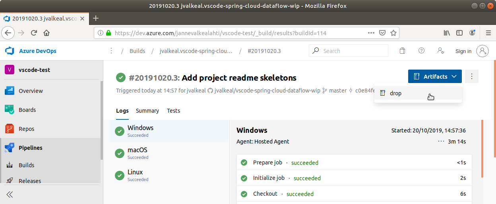

# VSCode extension for Spring Cloud Data Flow
This repository hosts modules to build extension for SCDF.

Current modules are:
- vscode-spring-cloud-dataflow
  - Actual vscode project resulting a real vsix extension file
- vscode-extension-core
  - Generic purpose library sharing common vscode extension features
- vscode-extension-di
  - Generic purpose library sharing common infersify based features to build extension atop of vscode-extension-core
- spring-cloud-dataflow-language-server
  - Actual language server based on a spring-dsl project.

See individual readme's in these project for futher info.

**NOTE**: As whis project is currently work-in-progress we're keeping all related projects under one repo.
          At some point in future all these will become a separate repos with individual lifecycle as idea
          is to have generic purpose core extension library(for those who don't want to marry with
          [inversify](http://inversify.io/), and DI library based on [inversify](http://inversify.io/)
          to easy extension development. SCDF Language Server inself will be a generic purpose implementation
          which can be used from any Language Client which chooce to do an integration into it.

Until we start publishing this extension into a VSCode marketplace, you can pick snapshot build out from a
[Azure Pipeline Build](https://dev.azure.com/jannevalkealahti/vscode-test/_build?definitionId=3). Pick a latest
master build:


Then download a `drop` file and `vsix` file will be inside of it:
```bash
$ unzip -l drop.zip
Archive:  drop.zip
  Length      Date    Time    Name
---------  ---------- -----   ----
        0  2019-10-20 14:01   drop/
 47485336  2019-10-20 14:01   drop/vscode-spring-cloud-dataflow-0.0.1.vsix
---------                     -------
 47485336                     2 files
```

Generic purpose uninstall/install procedure with vscode is:
```
$ code --uninstall-extension vscode-spring-cloud-dataflow-0.0.1.vsix
$ code
$ code --install-extension vscode-spring-cloud-dataflow-0.0.1.vsix
$ code
```

**NOTE**: Currently in vscode when trying to replace existing extension with a same
          version you need to start vscode after requesting _uninstall_ as for some
          weird reason _uninstall_ actually happens only after you start a vscode.
          If it's your first time, just install vsix file within vscode or start
          it with `--install-extension`.
