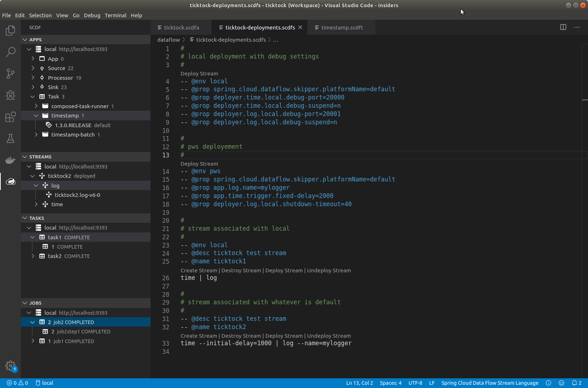

# VSCode extension for Spring Cloud Data Flow

VSCode extension for a Spring Cloud Data Flow is meant to help developers to
work with a development to manage and handle application, stream, tasks and jobs
in a SCDF environment.

## Features

Manage applications in an environment.

Manage streams in an environment.

Manage tasks in an environment.

Manage jobs in an environment.

## Requirements

Naturally existing SCDF environment either running on local, kubernetes or cloudfoundry.
